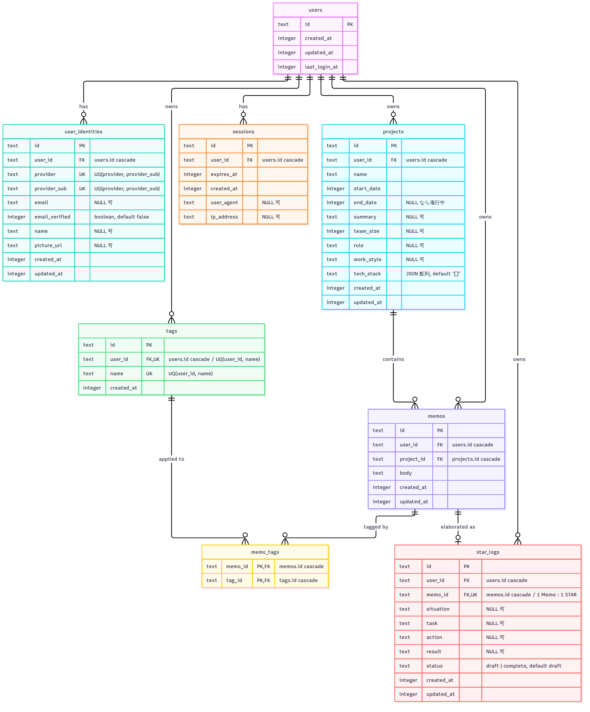

# データベース設計（ER 図）

StacX（Cloudflare D1 / SQLite）の全テーブルと関係。Drizzle スキーマ
（`packages/api/src/db/schema.ts`）が正典で、本図はその俯瞰用。
注記の無いカラムは NOT NULL。

図のソース（Mermaid）: [`docs/diagrams/er.mmd`](./diagrams/er.mmd)

## 補足（grill / ADR で確定した設計意図）

- **時刻はすべて epoch ミリ秒**（Drizzle `timestamp_ms`）。
- **表示情報の正典は `user_identities`**。`users` は ID と時刻のみ持つ（[ADR 0002](./adr/0002-user-table-id-only.md)）。
- **`projects.tech_stack` は JSON 配列**。絞り込み軸にしないため正規化しない（grill 決定）。表示専用。
- **`tags` は第一級エンティティ**で `(user_id, name)` 一意。Memo とは `memo_tags` で多対多。タイムラインの絞り込み軸。
- **`memos` は Project とのコンポジション**。生成時に 1 つの Project へ固定的に属し移動しない。`project_id` は `ON DELETE CASCADE` で、Project 削除時に Memo も連鎖削除される（[ADR 0005](./adr/0005-project-deletion-cascades-memos.md)）。
- **`star_logs` は 1 Memo : 1 STAR**（`memo_id` に一意制約）。S/T/A/R は下書きを許すため全カラム任意で、「1 項目以上」はリクエスト検証側で担保する。`status` が `complete` のものだけがレジュメ生成の対象。
- **`memo_tags` の両 FK も cascade**。Memo 削除・Tag 削除のどちらでも中間行が掃除される。
- **削除の連鎖の頂点は `users`**。アカウント削除で配下（identities / sessions / projects / tags / memos / star_logs / memo_tags）がすべて消える。

> 注意: SQLite の `ON DELETE CASCADE` は FK 強制が有効な接続でのみ働く。D1 ランタイムでの実挙動は統合テストで検証する。
